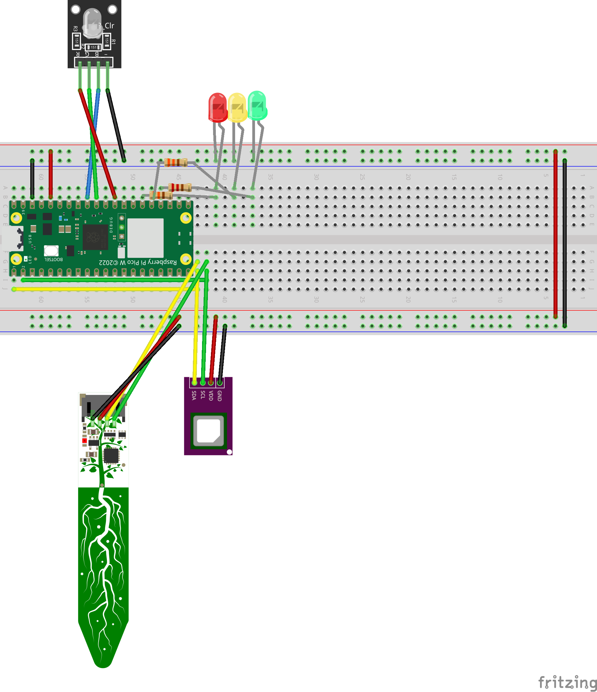
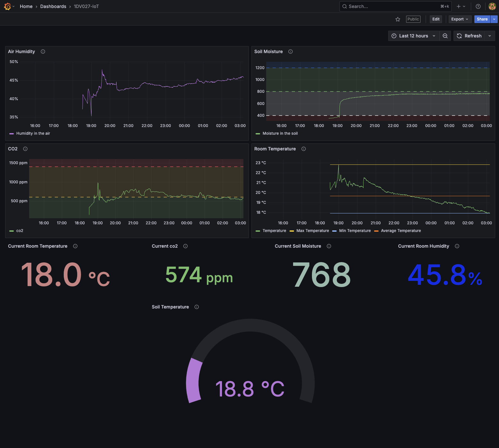

# 🌿 Raspberry Pi Pico IoT Sensor Node

This repository contains MicroPython code for a **Raspberry Pi Pico WH** acting as an IoT sensor node. It reads values from air and soil sensors and publishes them via **MQTT** to a remote **TIG stack** (Telegraf + InfluxDB + Grafana) hosted on a VPS.

Server side code can be found [here](https://github.com/MarkerAnn/1dv027_IoT_server)

---

## 🔧 Features

- 🪴 **Soil moisture & temperature** via STEMMA Soil Sensor
- 🌬️ **CO₂, humidity, and air temperature** via SCD40
- 🌈 **RGB LED** indicates soil moisture status (red, green, blue, white)
- 🟢 🟡 🔴 **LED indicators** for CO₂ level ranges (Good, OK, Poor)
- 📡 Publishes JSON sensor data to `pico/sensors` over MQTT

---

## 🧩 Wiring (Pico WH GPIO Pinout)

### I2C Sensors (shared bus)
| Sensor | VCC | GND | SDA (GPIO 0) | SCL (GPIO 1) |
|--------|-----|-----|---------------|--------------|
| SCD40 (CO₂) | 3.3V | GND | GPIO 0 | GPIO 1 |
| STEMMA Soil Sensor | 3.3V | GND | GPIO 0 | GPIO 1 |

### RGB LED (common cathode, moisture indication)
| Color | Pin | GPIO |
|-------|-----|------|
| Red   | R   | GPIO 22 |
| Green | G   | GPIO 26 |
| Blue  | B   | GPIO 27 |
| GND   | -   | GND |

### CO₂ LED Indicators
| Color | Resistor | GPIO | GND |
|-------|----------|------|-----|
| Red   | 330Ω     | GPIO 18 | GND |
| Yellow| 330Ω     | GPIO 19 | GND |
| Green | 330Ω     | GPIO 20 | GND |



---

## 🛰️ Data Format

The Pico publishes sensor data every `MEASUREMENT_INTERVAL` seconds to the MQTT topic:

```json
{
  "co2": 618,
  "temp_air": 22.5,
  "rh_air": 45.2,
  "moisture": 840,
  "temp_soil": 20.3
}
````

---

## 📦 File Overview

| File                        | Description                                                      |
| --------------------------- | ---------------------------------------------------------------- |
| `main.py`                   | Main script for initializing sensors, LEDs, WiFi and MQTT        |
| `lib/scd40.py`              | Driver for SCD40 (CO₂, temp, humidity)                           |
| `lib/stemma_soil_sensor.py` | Driver for STEMMA soil sensor                                    |
| `umqtt_simple.py`           | Lightweight MQTT client for MicroPython                          |
| `basic_tests_sensors/`      | Test scripts for RGB, LEDs, I2C                                  |
| `.micropico`                | Project marker file for development tools                        |
| `config.py`                 | (Excluded) Holds WiFi & MQTT credentials (imported in `main.py`) |

⚠️ Make sure to create your own `config.py` with the following variables:

````python
WIFI_SSID = "your-ssid"
WIFI_PASSWORD = "your-password"
MQTT_SERVER = "your-mqtt-broker-ip"
MQTT_PORT = 1883
MQTT_CLIENT_ID = "pico-client-id"
MQTT_TOPIC_BASE = "pico/sensors"
MEASUREMENT_INTERVAL = 10  # seconds
````

---

## 🖥️ TIG Stack Integration

Sensor data is picked up by **Telegraf** (via MQTT plugin), forwarded to **InfluxDB**, and visualized in **Grafana**. The full stack runs on VPS via Docker Compose with GitHub Actions CI/CD. 
[Link to the directory](https://github.com/MarkerAnn/1dv027_IoT_server)

* Telegraf config path: `telegraf/telegraf.conf`
* MQTT broker config: `mosquitto/config/mosquitto.conf`
* Deployment flow: `.github/workflows/deploy.yml`

---

## 📈 Live Dashboards

* **Grafana**: [https://angelicamarker.online/1dv027/iot/grafana](https://angelicamarker.online/1dv027/iot/grafana)
* **InfluxDB UI**: [https://influx.angelicamarker.online](https://influx.angelicamarker.online)



---

## 🧪 Local Testing

To test without the Pico, simulate sensor data using:

````bash
mosquitto_pub -h localhost -t pico/sensors/test -m '{"temp_air": 23.0, "co2": 650}'
````

---

## 📜 License

MIT © 2025 Angelica Marker


